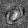
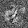

# Relevance-Prop
A numpy implementation of [On Pixel-Wise Explanations for Non-Linear Classifier Decisions by Layer-Wise Relevance Propagation](https://journals.plos.org/plosone/article?id=10.1371/journal.pone.0130140). Unlike the paper, there is no leakage of relevance in this implementation, so the total relevance remains the same across the layers. Uses my [Numpy-Atrous-Transposed-CNN](https://github.com/many-facedgod/Numpy-Atrous-Transposed-CNN) repository as a submodule. 

## Requirements
- Numpy
- Imageio
- tqdm

## Usage
Currently only the fully-connected and the ReLU layers are supported. The model is represented by the `RelPropNetwork` class, to which the layers `RelFCLayer`, `RelReluLayer` and `RelSoftmaxCELayer` can be added, with the last layer always being the softmax layer. The model can be trained by running the `forward`, `backward` and `adam_trainstep`. The relevance maps can be generated by the `backward_relevance` method after running the `forward` method. An example running on the MNIST dataset is shown in `relevance_prop_mnist.py`.

## Examples

Here are the relevance maps for MNIST digits from 0 to 9 (the relevance was calculated corresponding to the correct label)

          

## References

1   S. Bach, A. Binder, G. Montavon, F. Klauschen, K.-R. Müller, and W. Samek, “On Pixel-wise Explanations for Non-Linear Classifier Decisions by Layer-wise Relevance Propagation”, PLOS ONE, vol. 10, no. 7, pp. e0130140, July 2015.